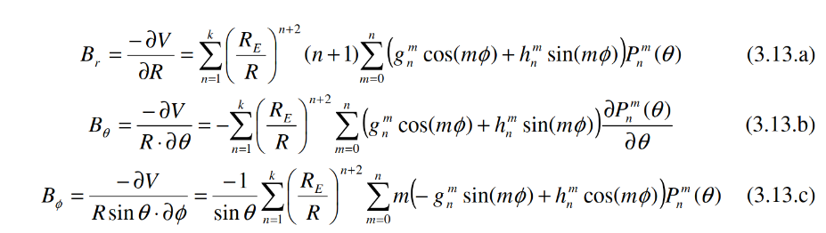
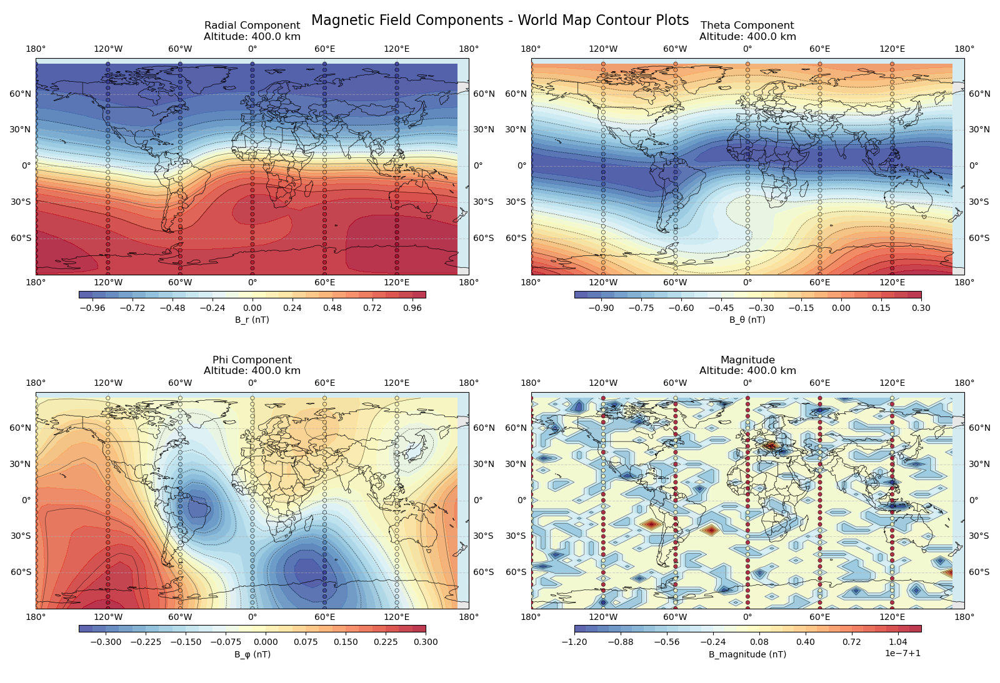
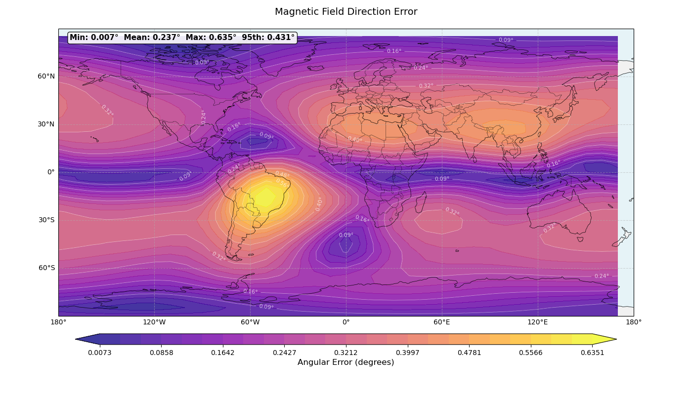

# Magnetic Field Model

Owner: [@Lundeen](https://ssi-teams.slack.com/team/U07R0F0STPS)

[Github pull request](https://github.com/stanford-ssi/samwise-adcs-flight/pull/36)

## Outline

The satellite knows where it is because it has a GPS.
Using GPS coordinates, the satellite can use an internal model of the earth's magnetic field to calculate what the magnetic field vector should be at that point. This can later be compared with magnetometer readings to calculate the attitude of the satellite.

## Resources

[Masters thesis by Gießelmann](https://www.raumfahrt.fh-aachen.de/compass-1/download/Development%20of%20an%20Active%20Magnetic%20Attitude%20Determination%20and%20Control%20System%20for%20Picosatellites%20on%20highly%20inclined%20circular%20Low%20Earth%20Orbits.pdf)

[IGRF14 coefficients](https://www.ngdc.noaa.gov/IAGA/vmod/coeffs/igrf14coeffs.txt)

## Details

Because the magnetic field has no sources in space (no large currents or changing electric fields) it can be described as the gradient of a scalar function, and this scalar function must satisfy a laplace equation.
The laplace equation is solved for spherical potentials and it can be shown that solutions to the laplace equation must be in the form of a radial function times a spherical harmonic.

The spherical harmonics are simply a sinusoid in the phi(azimuthal) direction and a legendre polynomial in the theta (altitude) direction.

Because we know that the magnetic field is the gradient of this potential, we can find its components analytically by taking this gradient. These are shown in the equations below from Gießelmann.


These equations tell us what we need to calculate:

1. The spherical harmonics (evalutated at our phi, theta).
2. The derivatives of the harmonics to give us the theta term.
3. The harmonic coefficients. These are measured by NOAA and [listed in the resource above. We will store these but not calculate them ourselves. 

## Calculating Legendre Polynomials
[Wikipedia on associated legendre functions](https://en.wikipedia.org/wiki/Associated_Legendre_polynomials)
Technically these are not polynomials, but functions because they have non integer powers.
The values (calculated at a given theta and phi) are stored in an array as follows:
``` cpp
const float P = Pnm[n][m]; // Legendre polynomials
const float dP = Pnm[m][n+1] // Derivatives
```
There is a funny little recursion relation that I don't quite understand to generate them.

**TODO: Ask Lundeen how this works.**

## Results
First we need to run the script by modifying main.
First add the proper include:
```cpp
#include "tests/b_field_tests.h"
```
Then add the test scripts after initalizing slate:
```cpp
test_b_field_reference_points(&slate);
test_b_field_mapping(&slate);
test_b_field_ecef_conversion(&slate);
```
As you run it you can run the python script in utils:
```bash
$ python serial_copy.py
```

This script literally just takes the output from the serial usb stream and dumps it all straight into a .txt file.
I then processed the file (I deleted the lines that I didn't need in a text editor), and copied the file over to the /igrf folder. I also renamed it to magnetic_data.csv so that it would play well with the scripts we have there.
The images below are generated respectively using
```bash
$ python magnetic_plotter.py

$ python igrf_comparison.py
```


Note that the legend on the magnitude is displaying magnitude 1e-7+1.
Meaning that the magnitude is well normalized nearly everwhere, allowing for some floating point rounding.


